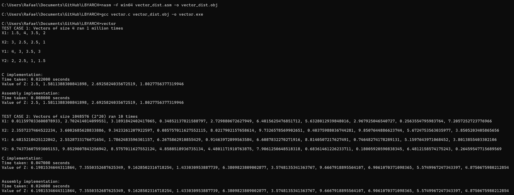

## Setup

### Prerequisites
- gcc x64 compiler
- nasm x64 compiler

### Running the Program

compile the .asm file using nasm
```bash
nasm -f win64 vector_dist.asm -o vector_dist.obj
```

compile the c file together with the created obj file
```bash
gcc vector.c vector_dist.obj -o vector.exe
```

run the executable
```bash
vector
```

### Expected Output


## Analysis

### TEST CASE 1: Small N, Multiple iterations

Observation:

- ASM version is roughly 2.75× faster than C for repeated small-vector computations.

- Both implementations produce identical, high-precision results.

- Small vectors require repeated runs to have measurable results

### TEST CASE 2: Large N, Few iterations

Observation:

- ASM is roughly 2× faster than C on large vectors.

- Both implementations remain numerically identical, demonstrating correctness.

- Larger data shows ASM maintains performance advantage due to low level optimizations.

## Video
<video src="https://github.com/cnadine/LBYARCH/releases/download/v1.0-video/video_source.code.compilation.execution.mp4" width="640" controls></video>
